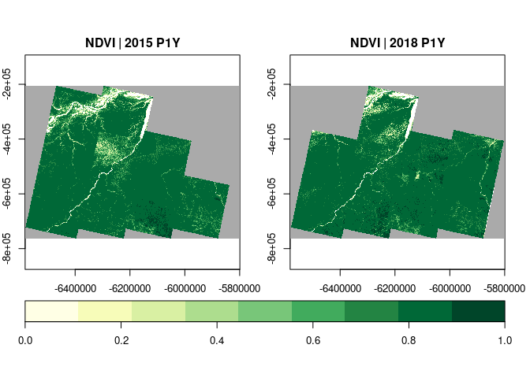
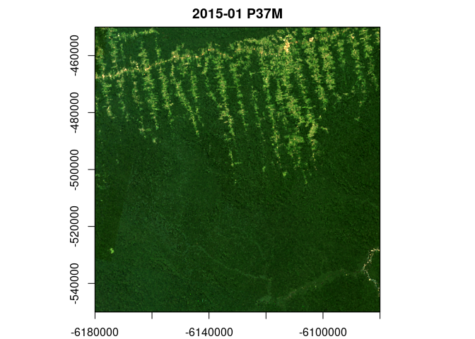
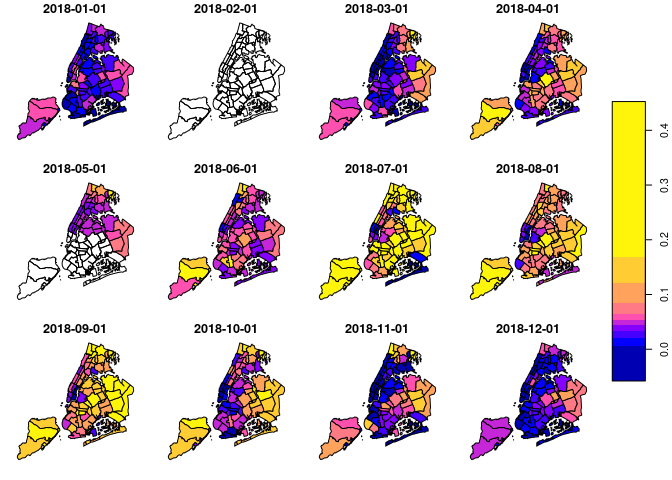

# gdalcubes 

[](https://travis-ci.org/appelmar/gdalcubes_R)
[](https://ci.appveyor.com/project/appelmar/gdalcubes-r)
[](https://cran.r-project.org/package=gdalcubes)
[](https://cran.r-project.org/package=gdalcubes)

The R package `gdalcubes` aims at making analyses of large satellite
image collections easier, faster, more intuitive, and more interactive.

The package represents the data as *regular raster data cubes* with
dimensions `bands`, `time`, `y`, and `x` and hides complexities in the
data due to different spatial resolutions,map projections, data formats,
and irregular temporal sampling.

# Features

-   Read and process multitemporal, multispectral Earth observation
    image collections as *regular raster data cubes* by applying
    on-the-fly reprojection, rescaling, cropping, and resampling.
-   Work with existing Earth observation imagery on local disks or cloud
    storage without the need to maintain a 2nd copy of the data.
-   Apply user-defined R functions on data cubes.
-   Execute data cube operation chains using parallel processing and
    lazy evaluation.

Among others, the package has been successfully used to process data
from the Sentinel-2, Landsat, PlanetScope, MODIS, and Global
Precipitation Measurement Earth observation satellites / missions.

# Installation

Install from CRAN with:

``` r
install.packages("gdalcubes")
```

## From sources

Installation from sources is easiest with

``` r
remotes::install_git("https://github.com/appelmar/gdalcubes_R")
```

Please make sure that the [git command line
client](https://git-scm.com/downloads) is available on your system.
Otherwise, the above command might not clone the gdalcubes C++ library
as a submodule under src/gdalcubes.

The package builds on the external libraries
[GDAL](https://www.gdal.org),
[NetCDF](https://www.unidata.ucar.edu/software/netcdf),
[SQLite](https://www.sqlite.org), and
[curl](https://curl.haxx.se/libcurl).

## Windows

On Windows, you will need
[Rtools](https://cran.r-project.org/bin/windows/Rtools). System
libraries are automatically downloaded from
[rwinlib](https://github.com/rwinlib).

## Linux

Please install the system libraries e.g. with the package manager of
your Linux distribution. Also make sure that you are using a recent
version of GDAL (&gt;2.3.0). On Ubuntu, the following commands install
all libraries.

    sudo add-apt-repository ppa:ubuntugis/ppa && sudo apt-get update
    sudo apt-get install libgdal-dev libnetcdf-dev libcurl4-openssl-dev libsqlite3-dev libudunits2-dev

## MacOS

Use [Homebrew](https://brew.sh) to install system libraries with

    brew install pkg-config
    brew install gdal
    brew install netcdf
    brew install libgit2
    brew install udunits
    brew install curl
    brew install sqlite

# Getting started

## Download example data

``` r
if (!dir.exists("L8_Amazon")) {
  download.file("https://uni-muenster.sciebo.de/s/e5yUZmYGX0bo4u9/download", destfile = "L8_Amazon.zip")
  unzip("L8_Amazon.zip", exdir = "L8_Amazon")
}
```

## Creating an image collection

At first, we must scan all available images once, and extract some
metadata such as their spatial extent and acquisition time. The
resulting *image collection* is stored on disk, and typically consumes a
few kilobytes per image. Due to the diverse structure of satellite image
products, the rules how to derive the required metadata are formalized
as *collection\_formats*. The package comes with predefined formats for
some Sentinel, Landsat, and MODIS products (see `collection_formats()`
to print a list of available formats).

``` r
library(gdalcubes)

gdalcubes_options(threads=8)

files = list.files("L8_Amazon", recursive = TRUE, 
                   full.names = TRUE, pattern = ".tif") 
length(files)
```

    ## [1] 1800

``` r
sum(file.size(files)) / 1024^2 # MiB
```

    ## [1] 1919.118

``` r
L8.col = create_image_collection(files, format = "L8_SR", out_file = "L8.db")
```

## Creating data cubes

To create a regular raster data cube from the image collection, we
define the geometry of our target cube as a *data cube view*, using the
`cube_view()` function. We define a simple overview, covering the full
spatiotemporal extent of the imagery at 1km x 1km pixel size where one
data cube cell represents a duration of one year. The provided
resampling and aggregation methods are used to spatially reproject,
crop, and rescale individual images and combine pixel values from many
images within one year respectively. The `raster_cube()` function
returns a *proxy* object, i.e., it returns immediately without doing any
expensive computations.

``` r
v.overview = cube_view(extent=L8.col, dt="P1Y", dx=1000, dy=1000, srs="EPSG:3857", 
                      aggregation = "median", resampling = "bilinear")
raster_cube(L8.col, v.overview)
```

    ## A GDAL data cube proxy object
    ## 
    ## Dimensions:
    ##                 low              high count pixel_size chunk_size
    ## t              2013              2019     7        P1Y          1
    ## y -764014.387686915 -205014.387686915   559       1000        256
    ## x -6582280.06164712 -5799280.06164712   783       1000        256
    ## 
    ## Bands:
    ##         name offset scale nodata unit
    ## 1    AEROSOL      0     1    NaN     
    ## 2        B01      0     1    NaN     
    ## 3        B02      0     1    NaN     
    ## 4        B03      0     1    NaN     
    ## 5        B04      0     1    NaN     
    ## 6        B05      0     1    NaN     
    ## 7        B06      0     1    NaN     
    ## 8        B07      0     1    NaN     
    ## 9   PIXEL_QA      0     1    NaN     
    ## 10 RADSAT_QA      0     1    NaN

## Processing data cubes

We can apply (and chain) operations on data cubes:

``` r
suppressPackageStartupMessages(library(magrittr)) # for %>%
x = raster_cube(L8.col, v.overview) %>%
  select_bands(c("B02","B03","B04")) %>%
  reduce_time(c("median(B02)","median(B03)","median(B04)"))
x
```

    ## A GDAL data cube proxy object
    ## 
    ## Dimensions:
    ##                 low              high count pixel_size chunk_size
    ## t              2013              2019     1        P7Y          1
    ## y -764014.387686915 -205014.387686915   559       1000        256
    ## x -6582280.06164712 -5799280.06164712   783       1000        256
    ## 
    ## Bands:
    ##         name offset scale nodata unit
    ## 1 B02_median      0     1    NaN     
    ## 2 B03_median      0     1    NaN     
    ## 3 B04_median      0     1    NaN

``` r
plot(x, rgb=3:1, zlim=c(0,1200))
```

<!-- -->

``` r
library(RColorBrewer)
 raster_cube(L8.col, v.overview) %>%
  select_bands(c("B04","B05")) %>%
  apply_pixel(c("(B05-B04)/(B05+B04)"), names="NDVI") %>%
  plot(zlim=c(0,1),  nbreaks=10, col=brewer.pal(9, "YlGn"), key.pos=1)
```

<!-- -->

Calling data cube operations always returns *proxy* objects,
computations are started lazily when users call e.g. `plot()`.

## Animations

Multitemporal data cubes can be animated (thanks to the [magick
package](https://cran.r-project.org/web/packages/magick/index.html)):

``` r
v.subarea.yearly = cube_view(extent=list(left=-6180000, right=-6080000, bottom=-550000, top=-450000, 
                             t0="2014-01-01", t1="2018-12-31"), dt="P1Y", dx=50, dy=50,
                             srs="EPSG:3857", aggregation = "median", resampling = "bilinear")

raster_cube(L8.col, v.subarea.yearly) %>%
  select_bands(c("B02","B03","B04")) %>%
  animate(rgb=3:1, zlim=c(100,1000))
```

    ##   format width height colorspace matte filesize density
    ## 1    gif   672    480       sRGB FALSE        0   72x72
    ## 2    gif   672    480       sRGB  TRUE        0   72x72
    ## 3    gif   672    480       sRGB  TRUE        0   72x72
    ## 4    gif   672    480       sRGB  TRUE        0   72x72
    ## 5    gif   672    480       sRGB  TRUE        0   72x72

<!-- -->

## Data cube export

Data cubes can be exported as single netCDF files with `write_ncdf()`,
or as a collection of (possibly cloud-optimized) GeoTIFF files with
`write_tif()`, where each time slice of the cube yields one GeoTIFF
file. Data cubes can also be converted to `raster` or `stars`objects:

``` r
suppressPackageStartupMessages(library(raster))
raster_cube(L8.col, v.overview) %>%
  select_bands(c("B04","B05")) %>%
  apply_pixel(c("(B05-B04)/(B05+B04)"), names="NDVI") %>%
  write_tif() %>%
  stack() -> x
x
```

    ## class      : RasterStack 
    ## dimensions : 559, 783, 437697, 7  (nrow, ncol, ncell, nlayers)
    ## resolution : 1000, 1000  (x, y)
    ## extent     : -6582280, -5799280, -764014.4, -205014.4  (xmin, xmax, ymin, ymax)
    ## crs        : +proj=merc +a=6378137 +b=6378137 +lat_ts=0 +lon_0=0 +x_0=0 +y_0=0 +k=1 +units=m +nadgrids=@null +wktext +no_defs 
    ## names      : cube_2a3ac18d60def2013, cube_2a3ac18d60def2014, cube_2a3ac18d60def2015, cube_2a3ac18d60def2016, cube_2a3ac18d60def2017, cube_2a3ac18d60def2018, cube_2a3ac18d60def2019

``` r
suppressPackageStartupMessages(library(stars))
raster_cube(L8.col, v.overview) %>%
  select_bands(c("B04","B05")) %>%
  apply_pixel(c("(B05-B04)/(B05+B04)"), names="NDVI") %>%
  st_as_stars() -> y
y
```

    ## stars object with 3 dimensions and 1 attribute
    ## attribute(s), summary of first 1e+05 cells:
    ##      NDVI       
    ##  Min.   :-0.56  
    ##  1st Qu.: 0.41  
    ##  Median : 0.72  
    ##  Mean   : 0.57  
    ##  3rd Qu.: 0.85  
    ##  Max.   : 0.89  
    ##  NA's   :79500  
    ## dimension(s):
    ##      from  to   offset delta                   refsys point
    ## x       1 783 -6582280  1000 WGS 84 / Pseudo-Mercator    NA
    ## y       1 559  -205014 -1000 WGS 84 / Pseudo-Mercator    NA
    ## time    1   7       NA    NA                  POSIXct FALSE
    ##                                                   values x/y
    ## x                                                   NULL [x]
    ## y                                                   NULL [y]
    ## time [2013-01-01,2014-01-01),...,[2019-01-01,2020-01-01)

To reduce the size of exported data cubes, compression and packing
(conversion of doubles to smaller integer types) are supported.

If only specific time slices of a data cube are needed, `select_time()`
can be called before plotting / exporting.

``` r
raster_cube(L8.col, v.overview) %>%
  select_bands(c("B04","B05")) %>%
  apply_pixel(c("(B05-B04)/(B05+B04)"), names="NDVI") %>%
  select_time(c("2015", "2018")) %>%
  plot(zlim=c(0,1), nbreaks=10, col=brewer.pal(9, "YlGn"), key.pos=1)
```

<!-- -->

## User-defined functions

Users can pass custom R functions to `reduce_time()` and
`apply_pixel()`. Below, we derive a *greenest pixel composite* by
returning RGB values from pixels with maximum NDVI for all pixel
time-series.

``` r
v.subarea.monthly = cube_view(view = v.subarea.yearly, dt="P1M", dx = 100, dy = 100,
                              extent = list(t0="2015-01", t0="2018-12"))
raster_cube(L8.col, v.subarea.monthly) %>%
  select_bands(c("B02","B03","B04","B05")) %>%
  apply_pixel(c("(B05-B04)/(B05+B04)"), names="NDVI", keep_bands=TRUE) %>%
  reduce_time(names=c("B02","B03","B04"), FUN=function(x) {
    if (all(is.na(x["NDVI",]))) return(rep(NA,3))
    return (x[c("B02","B03","B04"), which.max(x["NDVI",])])
  }) %>%
  plot(rgb=3:1, zlim=c(100,1000))
```

<!-- -->

## Extraction of pixels, time series, and summary statistics over polygons

In many cases, one is interested in extracting sets of points, time
series, or summary statistics over polygons, e.g., to generate training
data for machine learning models. Package version 0.3 therefore
introduces the functions `query_points()`, `query_timeseries()`, and
`zonal_statistics()`.

Below, we randomly select 10 locations and query values of single data
cube cells and complete time series.

``` r
x = runif(10, v.overview$space$left, v.overview$space$right)
y = runif(10, v.overview$space$bottom, v.overview$space$top)
t = sample(as.character(2013:2019), 10, replace = TRUE)
raster_cube(L8.col, v.overview) %>%
  select_bands(c("B04","B05")) %>%
  query_points(x,y,t, v.overview$space$srs)
```

    ##          B04       B05
    ## 1   176.5942 3032.5324
    ## 2        NaN       NaN
    ## 3  3878.2453 4828.9001
    ## 4   309.5338  221.7426
    ## 5        NaN       NaN
    ## 6   213.2422 3180.3651
    ## 7   725.4656 3244.4685
    ## 8        NaN       NaN
    ## 9   731.5507 2186.4171
    ## 10       NaN       NaN

``` r
raster_cube(L8.col, v.overview) %>%
  select_bands(c("B04","B05")) %>%
  query_timeseries(x, y, v.overview$space$srs)
```

    ## $B04
    ##        2013      2014     2015     2016     2017      2018      2019
    ## 1  168.1739  166.4379 199.2356 218.3613 176.5942  164.1710  152.0536
    ## 2       NaN       NaN      NaN      NaN      NaN       NaN       NaN
    ## 3  342.9068  198.0663 188.4386 171.4423 234.2039  176.9131 3878.2453
    ## 4       NaN  309.5338 653.0165 490.7659 334.7592  662.8106       NaN
    ## 5       NaN       NaN      NaN      NaN      NaN       NaN       NaN
    ## 6  158.2323  213.2422 288.2853 228.0108 222.6970  175.8526  152.9250
    ## 7       NaN  233.6421 286.0872 725.4656 234.8174 1012.2984       NaN
    ## 8       NaN       NaN      NaN      NaN      NaN       NaN       NaN
    ## 9  570.6068 1094.3404 698.8447 286.1469 731.5507       NaN  193.9442
    ## 10      NaN  242.1999 295.2309 283.9409 256.7757  270.4900       NaN
    ## 
    ## $B05
    ##        2013      2014      2015      2016      2017      2018      2019
    ## 1  2881.747 3006.7054 2988.5880 3004.6927 3032.5324 2856.9048 2918.1521
    ## 2       NaN       NaN       NaN       NaN       NaN       NaN       NaN
    ## 3  3117.646 3057.9624 2891.6479 2843.5118 3050.4765 2869.4212 4828.9001
    ## 4       NaN  221.7426  337.6181  220.5666  227.3253  435.6817       NaN
    ## 5       NaN       NaN       NaN       NaN       NaN       NaN       NaN
    ## 6  2991.214 3180.3651 3131.6213 3199.9639 3090.0413 3103.3886 3027.6535
    ## 7       NaN 2994.1378 3212.3224 3244.4685 2994.0125 2884.8660       NaN
    ## 8       NaN       NaN       NaN       NaN       NaN       NaN       NaN
    ## 9   663.193 1116.9384  650.0309  848.6397 2186.4171       NaN  394.6935
    ## 10      NaN 3167.8636 3493.6315 3106.9801 3229.5042 3434.0334       NaN

To compute time series of summary statistics over spatial polygons, we
need to specify polygon geometries (e.g., as an `sf` object) and specify
one or more statistics that we are interested in, similar as we can do
in `reduce_time()` or `reduce_space()`. In the following, we use the
example Landsat dataset (reduced resolution) provided with the package
and compute median NDVI within some administrative regions in New York
City. The result is a vector data cube in a GeoPackage file that can be
further processed and plotted by the `stars` package.

``` r
suppressPackageStartupMessages(library(sf))

L8_files <- list.files(system.file("L8NY18", package = "gdalcubes"),
                       ".TIF", recursive = TRUE, full.names = TRUE)
v = cube_view(srs="EPSG:32618", dy=300, dx=300, dt="P1M", 
              aggregation = "median", resampling = "bilinear",
              extent=list(left=388941.2, right=766552.4,
                          bottom=4345299, top=4744931, 
                          t0="2018-01-01", t1="2018-12-31"))
raster_cube(create_image_collection(L8_files, "L8_L1TP"), v) %>%
  select_bands(c("B04", "B05")) %>%
  apply_pixel("(B05-B04)/(B05+B04)", "NDVI") %>%
  zonal_statistics(system.file("nycd.gpkg", package = "gdalcubes"),
                  expr = "median(NDVI)", as_stars = TRUE) %>%
  plot(max.plot = 12)
```

<!-- -->

Though this is a small toy example only, the implementation works for a
large number of polygons and bigger data cubes, too (tested with 50k
polygons and approx. 500GB Sentinel-2 imagery at 10m spatial
resolution).

# More Features

**Mask bands**: Imagery that comes with existing masks (e.g. general
pixel quality measures or cloud masks) can apply masks during the
construction of the raster data cube, such that masked values will not
contribute to data cube values.

**Chunk streaming**: Internally, data cubes are chunked. Users can
modify the size of chunks as an argument to the `raster_cube()`
function. This can be useful for performance tuning, or for applying
user-defined R functions independently over all chunks, by using the
`chunk_apply()` function.

# Limitations

-   There is no support for vector data cubes
    ([stars](https://cran.r-project.org/package=stars) has vector data
    cubes).
-   Data cubes are limited to four dimensions
    ([stars](https://cran.r-project.org/package=stars) has cubes with
    any number of dimensions).
-   Some operations such as `window_time()` do not support user-defined
    functions at the moment.
-   Images must be orthorectified / regularly gridded, Sentinel-1 or
    Sentinel-5P products require additional preprocessing.
-   Using gdalcubes in distributed computing cloud infrastructures is
    still work in progress.

# Further reading

-   [Tutorial](https://appelmar.github.io/opengeohub_summerschool2019/tutorial.html)
    presented at OpenGeoHub Summer School 2019
-   [Blog post](https://www.r-spatial.org/r/2019/07/18/gdalcubes1.html)
    on r-spatial.org
-   [Open access paper](https://www.mdpi.com/2306-5729/4/3/92) in the
    special issue on Earth observation data cubes of the data journal
-   Some [introductory
    slides](https://github.com/appelmar/gdalcubes_docs/blob/master/gdalcubes_overview_slides.pdf)
