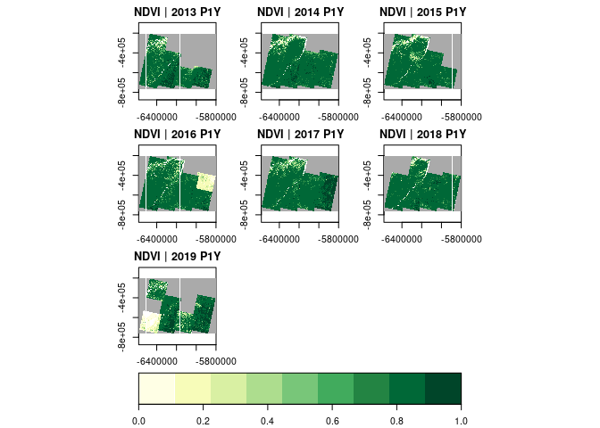
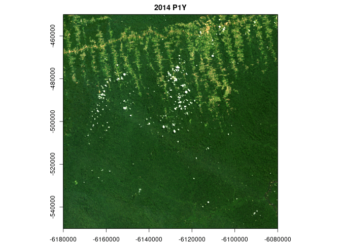

gdalcubes 
======================================================================

[](https://travis-ci.org/appelmar/gdalcubes_R) [](https://ci.appveyor.com/project/appelmar/gdalcubes-r) [](https://cran.r-project.org/package=gdalcubes)

The R package `gdalcubes` aims at making analyses of large satellite image collections easier, faster, more intuitive, and more interactive.

The package represents the data as *regular raster data cubes* with dimensions `bands`, `time`, `y`, and `x` and hides complexities in the data due to different spatial resolutions,map projections, data formats, and irregular temporal sampling.

Features
========

-   Read and process multitemporal, multispectral Earth observation image collections as *regular raster data cubes* by applying on-the-fly reprojection, rescaling, cropping, and resampling.
-   Work with existing Earth observation imagery on local disks or cloud storage without the need to maintain a 2nd copy of the data.
-   Apply user-defined R functions on data cubes.
-   Execute data cube operation chains using parallel processing and lazy evaluation.

Installation
============

Install from CRAN with:

``` r
install.packages("gdalcubes")
```

From sources
------------

Installation from sources is easiest with

``` r
remotes::install_git("https://github.com/appelmar/gdalcubes_R")
```

Please make sure that the [git command line client](https://git-scm.com/downloads) is available on your system. Otherwise, the above command might not clone the gdalcubes C++ library as a submodule under src/gdalcubes.

The package builds on the external libraries [GDAL](https://www.gdal.org), [NetCDF](https://www.unidata.ucar.edu/software/netcdf), [SQLite](https://www.sqlite.org), and [curl](https://curl.haxx.se/libcurl).

Windows
-------

On Windows, you will need [Rtools](https://cran.r-project.org/bin/windows/Rtools). System libraries are automatically downloaded from [rwinlib](https://github.com/rwinlib).

Linux
-----

Please install the system libraries e.g. with the package manager of your Linux distribution. Also make sure that you are using a recent version of GDAL (&gt;2.3.0). On Ubuntu, the following commands install all libraries.

    sudo add-apt-repository ppa:ubuntugis/ppa && sudo apt-get update
    sudo apt-get install libgdal-dev libnetcdf-dev libcurl4-openssl-dev libsqlite3-dev libudunits2-dev

MacOS
-----

Use [Homebrew](https://brew.sh) to install system libraries with

    brew install pkg-config
    brew install gdal
    brew install netcdf
    brew install libgit2
    brew install udunits
    brew install curl
    brew install sqlite

Getting started
===============

Download example data
---------------------

``` r
if (!dir.exists("L8_Amazon")) {
  download.file("https://uni-muenster.sciebo.de/s/e5yUZmYGX0bo4u9/download", destfile = "L8_Amazon.zip")
  unzip("L8_Amazon.zip", exdir = "L8_Amazon")
}
```

Creating an image collection
----------------------------

At first, we must scan all available images once, and extract some metadata such as their spatial extent and acquisition time. The resulting *image collection* is stored on disk, and typically consumes a few kilobytes per image. Due to the diverse structure of satellite image products, the rules how to derive the required metadata are formalized as *collection\_formats*. The package comes with predefined formats for some Sentinel, Landsat, and MODIS products (see `collection_formats()` to print a list of available formats).

``` r
library(gdalcubes)
```

    ## Using gdalcubes library version 0.2.0

``` r
gdalcubes_options(threads=8)

files = list.files("L8_Amazon", recursive = TRUE, 
                   full.names = TRUE, pattern = ".tif") 
length(files)
```

    ## [1] 1800

``` r
sum(file.size(files)) / 1024^2 # MiB
```

    ## [1] 1919.118

``` r
L8.col = create_image_collection(files, format = "L8_SR", out_file = "L8.db")
```

Creating data cubes
-------------------

To create a regular raster data cube from the image collection, we define the geometry of our targetr cube as a *data cube view*, using the `cube_view()` function. We define a simple overview, covering the full spatiotemporal extent of the imagery at 1km x 1km pixel size where one data cube cell represents a duration of one year. The provided resampling and aggregation methods are used to spatially reproject, crop, and rescale individual images and combine pixel values from many images within one year respectively. The `raster_cube()` function returns a *proxy* object, i.e., it returns immediately without doing any expensive computations.

``` r
v.overview = cube_view(extent=L8.col, dt="P1Y", dx=1000, dy=1000, srs="EPSG:3857", 
                      aggregation = "median", resampling = "bilinear")
raster_cube(L8.col, v.overview)
```

    ## A GDAL data cube proxy object
    ## 
    ## Dimensions:
    ##                 low              high count pixel_size chunk_size
    ## t              2013              2019     7        P1Y         16
    ## y -764014.387686915 -205014.387686915   559       1000        256
    ## x -6582280.06164712 -5799280.06164712   783       1000        256
    ## 
    ## Bands:
    ##         name offset scale nodata unit
    ## 1    AEROSOL      0     1    NaN     
    ## 2        B01      0     1    NaN     
    ## 3        B02      0     1    NaN     
    ## 4        B03      0     1    NaN     
    ## 5        B04      0     1    NaN     
    ## 6        B05      0     1    NaN     
    ## 7        B06      0     1    NaN     
    ## 8        B07      0     1    NaN     
    ## 9   PIXEL_QA      0     1    NaN     
    ## 10 RADSAT_QA      0     1    NaN

Processing data cubes
---------------------

We can apply (and chain) operations on data cubes:

``` r
suppressPackageStartupMessages(library(magrittr)) # for %>%
x = raster_cube(L8.col, v.overview) %>%
  select_bands(c("B02","B03","B04")) %>%
  reduce_time(c("median(B02)","median(B03)","median(B04)"))
x
```

    ## A GDAL data cube proxy object
    ## 
    ## Dimensions:
    ##                 low              high count pixel_size chunk_size
    ## t              2013              2013     1        P7Y          1
    ## y -764014.387686915 -205014.387686915   559       1000        256
    ## x -6582280.06164712 -5799280.06164712   783       1000        256
    ## 
    ## Bands:
    ##         name offset scale nodata unit
    ## 1 B02_median      0     1    NaN     
    ## 2 B03_median      0     1    NaN     
    ## 3 B04_median      0     1    NaN

``` r
plot(x, rgb=3:1, zlim=c(0,1200))
```


``` r
library(RColorBrewer)
 raster_cube(L8.col, v.overview) %>%
  select_bands(c("B04","B05")) %>%
  apply_pixel(c("(B05-B04)/(B05+B04)"), names="NDVI") %>%
  plot(zlim=c(0,1),  nbreaks=10, col=brewer.pal(9, "YlGn"), key.pos=1)
```



Calling data cube operations always returns *proxy* objects, computations are started lazily when users call e.g. `plot()`.

Animations
----------

Multitemporal data cubes can be animated (thanks to the [magick package](https://cran.r-project.org/web/packages/magick/index.html)):

``` r
v.subarea.yearly = cube_view(extent=list(left=-6180000, right=-6080000, bottom=-550000, top=-450000, 
                             t0="2014-01-01", t1="2018-12-31"), dt="P1Y", dx=50, dy=50,
                             srs="EPSG:3857", aggregation = "median", resampling = "bilinear")

raster_cube(L8.col, v.subarea.yearly) %>%
  select_bands(c("B02","B03","B04")) %>%
  animate(rgb=3:1, zlim=c(100,1000))
```

    ##   format width height colorspace matte filesize density
    ## 1    gif   672    480       sRGB FALSE        0   72x72
    ## 2    gif   672    480       sRGB  TRUE        0   72x72
    ## 3    gif   672    480       sRGB  TRUE        0   72x72
    ## 4    gif   672    480       sRGB  TRUE        0   72x72
    ## 5    gif   672    480       sRGB  TRUE        0   72x72



Data cube export
----------------

Data cubes can be exported as single netCDF files with `write_ncdf()`, or as a collection of (possibly cloud-optimized) GeoTIFF files with `write_tif()`, where each time slice of the cube yields one GeoTIFF file. Data cubes can also be converted to `raster` or `stars`objects:

``` r
suppressPackageStartupMessages(library(raster))
raster_cube(L8.col, v.overview) %>%
  select_bands(c("B04","B05")) %>%
  apply_pixel(c("(B05-B04)/(B05+B04)"), names="NDVI") %>%
  write_tif() %>%
  stack() -> x
x
```

    ## class      : RasterStack 
    ## dimensions : 559, 783, 437697, 7  (nrow, ncol, ncell, nlayers)
    ## resolution : 1000, 1000  (x, y)
    ## extent     : -6582280, -5799280, -764014.4, -205014.4  (xmin, xmax, ymin, ymax)
    ## crs        : +proj=merc +a=6378137 +b=6378137 +lat_ts=0.0 +lon_0=0.0 +x_0=0.0 +y_0=0 +k=1.0 +units=m +nadgrids=@null +no_defs 
    ## names      : cube_4e9d669f2f4f2013, cube_4e9d669f2f4f2014, cube_4e9d669f2f4f2015, cube_4e9d669f2f4f2016, cube_4e9d669f2f4f2017, cube_4e9d669f2f4f2018, cube_4e9d669f2f4f2019

``` r
suppressPackageStartupMessages(library(stars))
raster_cube(L8.col, v.overview) %>%
  select_bands(c("B04","B05")) %>%
  apply_pixel(c("(B05-B04)/(B05+B04)"), names="NDVI") %>%
  as_stars() -> y
y
```

    ## stars object with 3 dimensions and 1 attribute
    ## attribute(s), summary of first 1e+05 cells:
    ##      NDVI       
    ##  Min.   :-0.56  
    ##  1st Qu.: 0.41  
    ##  Median : 0.72  
    ##  Mean   : 0.57  
    ##  3rd Qu.: 0.85  
    ##  Max.   : 0.89  
    ##  NA's   :79497  
    ## dimension(s):
    ##      from  to   offset delta                       refsys point
    ## x       1 783 -6582280  1000 +proj=merc +a=6378137 +b=... FALSE
    ## y       1 559  -205014 -1000 +proj=merc +a=6378137 +b=... FALSE
    ## time    1   7       NA    NA                      POSIXct FALSE
    ##                         values    
    ## x                         NULL [x]
    ## y                         NULL [y]
    ## time 2013-01-01,...,2019-01-01

To reduce the size of exported data cubes, compression and packing (conversion of doubles to smaller integer types) are supported.

### User-defined functions

Users can pass custom R functions to `reduce_time()` and `apply_pixel()`. Below, we derive a *greenest pixel composite* by returning RGB values from pixels with maximum NDVI for all pixel time-series.

``` r
v.subarea.monthly = cube_view(view = v.subarea.yearly, dt="P1M", dx = 100, dy = 100,
                              extent = list(t0="2015-01", t0="2018-12"))
raster_cube(L8.col, v.subarea.monthly) %>%
  select_bands(c("B02","B03","B04","B05")) %>%
  apply_pixel(c("(B05-B04)/(B05+B04)"), names="NDVI", keep_bands=TRUE) %>%
  reduce_time(names=c("B02","B03","B04"), FUN=function(x) {
    if (all(is.na(x["NDVI",]))) return(rep(NA,3))
    return (x[c("B02","B03","B04"), which.max(x["NDVI",])])
  }) %>%
  plot(rgb=3:1, zlim=c(100,1000))
```


Advanced Features
=================

**Mask bands**: Imagery that comes with existing masks (e.g. general pixel quality measures or cloud masks) can apply masks during the construction of the raster data cube, such that masked values will not contribute to data cube values.

**Chunk streaming**: Internally, data cubes are chunked. Users can modify the size of chunks as an argument to the `raster_cube()` function. This can be useful for performance tuning, or for applying user-defined R functions independently over all chunks, by using the `chunk_apply()` function.

Limitations
===========

-   There is no support for vector data cubes ([stars](https://cran.r-project.org/package=stars) has vector data cubes).
-   Data cubes are limited to four dimensions ([stars](https://cran.r-project.org/package=stars) has cubes with any number of dimensions).
-   Operations such as `reduce_space()` or `window_time()` do not support user-defined functions at the moment.
-   Images must be orthorectified / regularly gridded, Sentinel-1 or Sentinel-5P products require additional preprocessing.
-   Using gdalcubes in cloud infrastructures is still work in progress.

Further reading
===============

-   [Blog post](https://www.r-spatial.org/r/2019/07/18/gdalcubes1.html) on r-spatial.org
-   [Open access paper](https://www.mdpi.com/2306-5729/4/3/92) in the special issue on Earth observation data cubes of the data journal
-   Some [introductory slides](https://github.com/appelmar/gdalcubes_docs/blob/master/gdalcubes_overview_slides.pdf)
